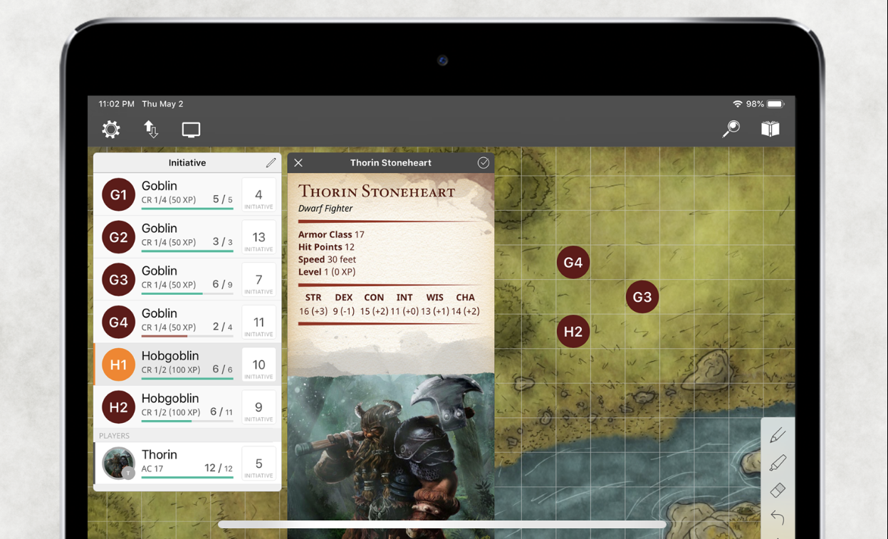
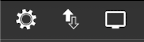
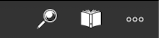
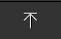

{.size-cover}

# Encounter+ Tutorial 
#####
This tutorial for Encounter+ is meant to help you get accilmated and familiar with the virutal tabletop software. To begin this will not be a comrehensive guide on how to use every feature in this app. However, it should have enough information to get you started. It is also meant to be used along side the included module: ***You Wished for Adventure!*** For more detailed information and instructions on Encounter+ please join our community on [Discord]().

### Getting Started 

To begin, there are several buttons on the screen. Each one has its own purpose and functions. If ever you get lost or need a little help, start by going to the **Help Center**. You can find it in the **Settings Panel** 

## Loading Maps from Modules

Loading maps included in modules is a straightforward Process. ***The use of Maps can be unlocked via the in-app purchase in the Settings or via the in-app Subscription.***

1. Find the map you'd like to use in your Library (it's the button that looks like a book)

    

2. In the top right corner of the this page you'll see the load button. Tap on it.

    

(print-page)

3. Share the map with your players. 

    - How you share you map differs on which platform you are using

    - **macOS** 

        * Click on the **External Screen** Button found in the upper left corner - *it looks like an blank monitor*.
        
            

        * Click on ***Open Window***

        * In the ***Battle Map*** section, click on **Presenting**, and ensure the map you want to display is selected. 

    - **iOS**

        * First, you must have Screen Mirroring enabled and connected

            

        * Once you are Screen Mirroring to compatible AirPlay reciever (such as an AppleTV), tap the **External Screen** button in Encounter+. *It is in the top left of your screen and looks like a blank monitor.*

            

        * In the ***Battle Map*** section, click on **Presenting**, and ensure the map you want to display is selected. 

4. There are several more options under the **External Screen** menu. To learn more about them head to the **Help Center** in the Settings panel. 

> **External Screen? How does it work?**
>
>You can use this app to display current initiative, images, or handouts in realtime during your sessions on a big screen like a TV or a data projector.
>
>You need to have an AppleTV or other device capable of AirPlay Screen Mirroring. You can find more about AirPlay here.
>
>Alternately, you can use an HDMI adapter and cable to directly connect to an external screen.
>

## Showing Content and Images to Players

Encounter+ allows you to show content to your players in a variety of ways. Some of the most common things you would want to present include location images, creature art, and text handouts. 

> **External Screen? How does it work?**
>
>You can use this app to display current initiative, images, or handouts in realtime during your sessions on a big screen like a TV or a projector. 
>
> How you achieve this varies by platform. On iOS devices, such as an iPad, you need to have an AppleTV or other device capable of **AirPlay Screen Mirroring** connected. (*You can do this from Control Center in iOS*)
>
>Alternately, you can use an HDMI adapter and cable to directly connect to an external screen. 
> 
>On MacOS you can create a separate window using the **External Screen** icon on the top right of interface. 
> 
>Finally, if you are sharing content using the new WebClient method, it will also send your chosen media there as well. 

(print-page)

* How to share an image from Encounter+ 

    - Tapping on an image will bring you to separate viewer that displays just that image

        

    - In the top left corner, you'll see a button that looks like a blank display (*On iOS you may need to tap anywhere on the image again for it to show*)

    - Tap on this button to send the image to whatever screen you are sharing with your players

        * You'll know that it is active when the Display button is filled in.

* How to share Text or Handouts

    - If there is written material or handouts you'd like the players to see on the screen you can share it from the **External Screen** button. It is located at the top left of the main screen and looks like a blank display.

        

    - In the ***Overlay*** section click or tap on **Type**. 

    - Select **Handout** and click or tap **Back**

    - You can now select the "Handout Style" as well as type or paste in the the text you'd like show the players. 

## Running Encounters

Running encounters in Encounter+ is fun, simple and helps you focus on the exiting parts of combat. 

Encounter+ is a great way to manage any combat encounter. It’s designed to quickly add creatures or NPCs as well Player Characters on the fly. It’s also designed to keep track of various conditions both positive and negative for each creature and Player in an encounter.
 
> **First things first, what is an encounter?** 
>
>An encounter is a collection of creatures assembled for the intent of going up against your player characters. An encounter is not part of a map. It’s a stand alone “object” that you can use with a map but techinically it is not part of the map. We keep enounters decoupled to provide flexibility. Using this approach allows you to mix and match encounters with maps. You can use any encounter with any map. 

#### The basics of running an Encounter are as follows {.text-center}

> **1. Create or Load an Encounter** {.text-center}
>{.flowchart}

> **2. Start Combat** {.text-center}
>{.flowchart-with-link}

> **3. Manage Combat** {.text-center}
>{.flowchart-with-link}

> **4. End combat and the encounter** {.text-center}
>{.flowchart-with-link}

(print-page)

#### 1. Creating an Encounter

There are several encounters included in the "You Wished For Adventure!" starter module. You can simply open and load these from the Library to get all of the monsters inserted in one fell swoop. 
That being said, you can also follow the steps listed below to customize encounters as well as insert the Player Characters

* Tap the Initiative Order button in the top left of the screen. It looks like a pair of upward and downard pointing arrows. 
    - 
* Tap the "..." more button on the top right of this menu.
* Select **"+ Insert Creatures"**      

* Choose between the following:
  
    - Monster or NPC: This will open the built-in Compendium for all the creatures stored within Encounter+.
 
    - Player Character: This will add any Player Characters that have been added tothe Encounter+ Compendium.

    ***Note**: The only creatures included in the Compendium are from the Systems Reference Document in compliance with Wizards of the Coast Open Gaming License v1.0a.*

    *Players can be added to the Compendium via tapping on the Library icon in the top right of the app.*

- The Checkmark can be tapped multiple times to add several of the same creature to a combat encounter.

#### 2. Starting Combat

Now that the monsters and players in your encounter are loaded, let's start combat. 

Tap **Start** in the bottom left of the screen to start the encounter. This will roll initiative for all the enemies in the encounter. 

***Note:** By default the app doesn’t roll initiative for the Player Characters. If desired, the app can roll for the PCs as well. Tap on the settings and change that setting.*

#### 3. Managing Combat

Manage the encounter by tapping on the **Initiative Order** icon.

For Player Characters, manually add their initiative into the Initiative block if the app is not rolling for their characters. You may notice there is also a helpful "ROLL" feature available here that will allow you roll for players characters as well. 

Creature and character health are tracked here as well. Tap on the creatures health and type in the amount of damage that creature has taken into the Damage Calculator. It will automatically subtract. Tap anywhere on the screen to dismiss the Damage Calculator.

*   ***Note:** Tap on the "MOD" button in the Damage Calculator to change the number to healing as opposed to damage.*

Tapping on the Arrows in the bottom right corner of the app interface once the Combat has started will highlight the next or previous creature in the initiative order to keep track of turns.

#### 4. Ending Combat

Once the combat has concluded, tap the **"Stop"** button in the lower left corner of the interface and the combat will end. Combat can be resumed if the Start button is tapped and combat will resume where the initiative last left off.

*   ***Note:** Combat can be toggled on or off at will. Combat does have to be stopped in order to add additional creatures to the combat. When Start is tapped there is an option to re-roll initiative. Tap Later if combat is to be resumed without re-rolling initiative.*

## Marking Creatures as Friendly

Encounter+ lets you easily add all of the creatures and content available in the SRD. Many of the creatures are useful as NPCs for your games. Thankfully, Encounter+ lets you easily mark any creature as "Friendly," so you manage them appropriately in encounter situations. To do so follow these steps. 

1. Find the creature you need in the Library and load into your encounter. You can find a guide on how to do so [here](running-encounters).

2. Swipe to left on the creature you'd like to change. You'll see a three buttons slide in. Tap on the yellow Edit button. 
    - 

(print-page)

3. The Edit Creature menu will open on your screen now. From here simply tap on "Friendly" and the creature will no longer be considered hostile in the encounter.
    - 