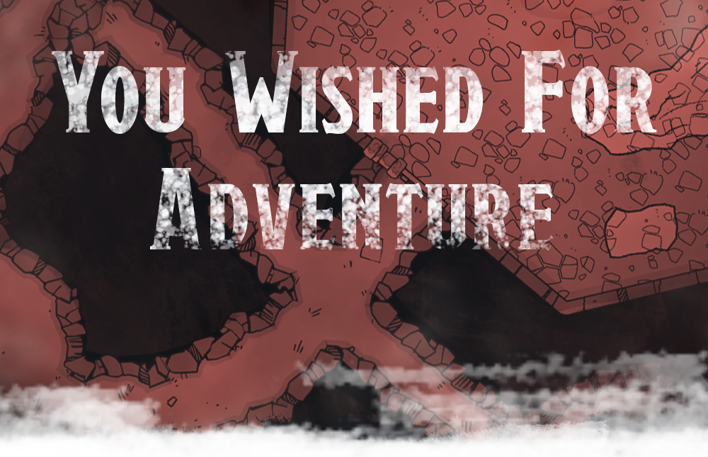

{.size-cover}

# You wished for Adventure!
### A first-level adventure for D&D 5E 

**SUMMARY:**
A two-hour adventure that helps players use and learn Encounter+.

This adventure lands the players smack dab in the middle of someone else’s wish spell. It’s scaled for 4-5 players at 1st level. 

**ADVENTURE DESIGNER:**

***Nate Abdo*** - Check out The AP Club on **[Instagram](https://www.instagram.com/theapclub)** and **[Twitch](https://www.twitch.tv/theapclub)** ([@theAPclub](https://linkin.bio/theapclub)) for more D&D 5E adventures and live-play using EncounterPlus.

**CONTRIBUTORS:**

***Jacob Johnson*** - Creator of [Module Packer for EncounterPlus](https://github.com/encounterplus/module-packer), a simple standalone application for converting markdown documents into modules for EncounterPlus. It also allows exporting the markdown files into a PDF with a similar style.

***Team-Hufflepuff*** - map contributions, [Reddit /u/Team-Hufflepuff](https://www.reddit.com/user/Team-Hufflepuff)

*DUNGEONS & DRAGONS, D&D, Wizards of the Coast, Forgotten Realms, the dragon ampersand, Player’s Handbook, Monster Manual, Dungeon Master’s Guide, D&D Adventurers League, all other Wizards of the Coast product names, and their respective logos are trademarks of Wizards of the Coast in the USA and other countries. All characters and their distinctive likenesses are property of Wizards of the Coast. This material is protected under the copyright laws of the United States of America. Any reproduction or unauthorized use of the material or artwork contained herein is prohibited without the express written permission of Wizards of the Coast.*